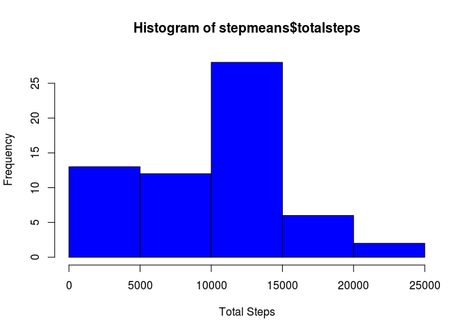
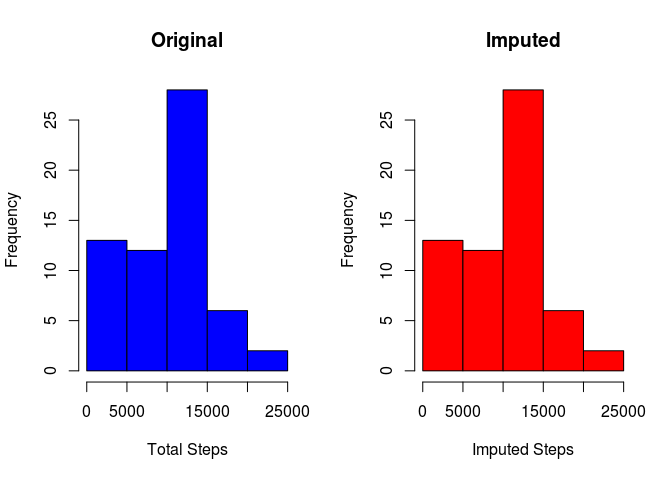
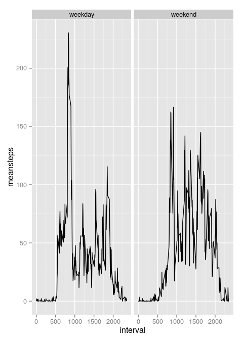

# Reproducible Research: Peer Assessment 1


## Loading and preprocessing the data
To get started, I loaded some libraries to assist in data analysis.

1. `dplyr` provides handy data manipulation tools and the `%>%` pipe operator.
2. `ggplot2` makes it easy to create modern charts.


```r
  require(dplyr,warn.conflicts=F)
```

```
## Loading required package: dplyr
```

```r
  require(ggplot2,warn.conflicts=F)
```

```
## Loading required package: ggplot2
```


Then I downloaded the data, checking to see if it the data already exists on disk. When the data is available, I unzipped it, again checking to make sure it hasn't already been done.


```r
  if( !file.exists('activity.zip')) {
    download.file(  'https://d396qusza40orc.cloudfront.net/repdata%2Fdata%2Factivity.zip'
                  , destfile = 'activity.zip'
                  , method = 'curl')
    }
  if( !file.exists('activity.csv')) {
    unzip('activity.zip')
    }
```

Next, I read all the data into a single object, activity, then converted the date field to from a character class to POSIXct.


```r
  if( !exists('activity')) {
    activity  <- read.csv('activity.csv')
    activity$date  <- as.POSIXct(activity$date)
    }
```


## What is mean total number of steps taken per day?

To determine the total number of steps taken per day, I grouped the data by date and calculated some summary statistics: 

* total number of steps
* mean number of steps
* median number of steps


```r
  stepmeans  <- activity %>%
    group_by(date) %>%
    summarize(  totalsteps  = sum   (steps, na.rm = T)
              , meansteps   = mean  (steps, na.rm = T)
              , mediansteps = median(steps, na.rm = T)
      )
```

With that data in hand, I looked at the total number of steps per day with a quick histogram, developing a picture of the frequencies:

```r
  hist(stepmeans$totalsteps,xlab = 'Total Steps',col='blue',)
```

 

Behind that histogram is the calcultaed data itself. Below, I'm also including median for the sake of clarity:

```r
  stepmeans
```

```
## Source: local data frame [61 x 4]
## 
##          date totalsteps  meansteps mediansteps
## 1  2012-10-01          0        NaN          NA
## 2  2012-10-02        126  0.4375000           0
## 3  2012-10-03      11352 39.4166667           0
## 4  2012-10-04      12116 42.0694444           0
## 5  2012-10-05      13294 46.1597222           0
## 6  2012-10-06      15420 53.5416667           0
## 7  2012-10-07      11015 38.2465278           0
## 8  2012-10-08          0        NaN          NA
## 9  2012-10-09      12811 44.4826389           0
## 10 2012-10-10       9900 34.3750000           0
## 11 2012-10-11      10304 35.7777778           0
## 12 2012-10-12      17382 60.3541667           0
## 13 2012-10-13      12426 43.1458333           0
## 14 2012-10-14      15098 52.4236111           0
## 15 2012-10-15      10139 35.2048611           0
## 16 2012-10-16      15084 52.3750000           0
## 17 2012-10-17      13452 46.7083333           0
## 18 2012-10-18      10056 34.9166667           0
## 19 2012-10-19      11829 41.0729167           0
## 20 2012-10-20      10395 36.0937500           0
## 21 2012-10-21       8821 30.6284722           0
## 22 2012-10-22      13460 46.7361111           0
## 23 2012-10-23       8918 30.9652778           0
## 24 2012-10-24       8355 29.0104167           0
## 25 2012-10-25       2492  8.6527778           0
## 26 2012-10-26       6778 23.5347222           0
## 27 2012-10-27      10119 35.1354167           0
## 28 2012-10-28      11458 39.7847222           0
## 29 2012-10-29       5018 17.4236111           0
## 30 2012-10-30       9819 34.0937500           0
## 31 2012-10-31      15414 53.5208333           0
## 32 2012-11-01          0        NaN          NA
## 33 2012-11-02      10600 36.8055556           0
## 34 2012-11-03      10571 36.7048611           0
## 35 2012-11-04          0        NaN          NA
## 36 2012-11-05      10439 36.2465278           0
## 37 2012-11-06       8334 28.9375000           0
## 38 2012-11-07      12883 44.7326389           0
## 39 2012-11-08       3219 11.1770833           0
## 40 2012-11-09          0        NaN          NA
## 41 2012-11-10          0        NaN          NA
## 42 2012-11-11      12608 43.7777778           0
## 43 2012-11-12      10765 37.3784722           0
## 44 2012-11-13       7336 25.4722222           0
## 45 2012-11-14          0        NaN          NA
## 46 2012-11-15         41  0.1423611           0
## 47 2012-11-16       5441 18.8923611           0
## 48 2012-11-17      14339 49.7881944           0
## 49 2012-11-18      15110 52.4652778           0
## 50 2012-11-19       8841 30.6979167           0
## 51 2012-11-20       4472 15.5277778           0
## 52 2012-11-21      12787 44.3993056           0
## 53 2012-11-22      20427 70.9270833           0
## 54 2012-11-23      21194 73.5902778           0
## 55 2012-11-24      14478 50.2708333           0
## 56 2012-11-25      11834 41.0902778           0
## 57 2012-11-26      11162 38.7569444           0
## 58 2012-11-27      13646 47.3819444           0
## 59 2012-11-28      10183 35.3576389           0
## 60 2012-11-29       7047 24.4687500           0
## 61 2012-11-30          0        NaN          NA
```


## What is the average daily activity pattern?

To determine if any sorts of patterns exists by time, I grouped the data by time interval, then summarized it to calculate the mean number of steps taken each interval.


```r
  pattern  <- activity %>%
    group_by(interval) %>%
    summarize(meansteps = mean(steps,na.rm=T)) %>%
    arrange(interval)
```

I ploted the mean number of steps on the y axis against the time interval on the x axis as a line plot to get a high level overview of daily patterns.

```r
  plot(meansteps ~ interval, data=pattern,type='l',ylab='mean steps',xlab='interval')
```

 

It seems that the interval with the most amount of steps is 8:35 am:

```r
  pattern %>%
    arrange(-meansteps) %>%
    head(1)
```

```
## Source: local data frame [1 x 2]
## 
##   interval meansteps
## 1      835  206.1698
```

  

## Imputing missing values
Unfortunately, much of the data in this set is missing:

```r
  #number of rows with missing data
  sum(!complete.cases(activity))
```

```
## [1] 2304
```

```r
  #percentage of data missing
  sum(!complete.cases(activity))/nrow(activity)
```

```
## [1] 0.1311475
```

2304 rows with missing data means that over 13% of our data is missing.

However, only the step data is missing--date and interval data is still available. There is not a distinguishable pattern for the number of steps take per day, whereas there is a clear pattern for the time interval. With that in mind, I imputed missing data with the mean value of steps for the each interval.


```r
  a2  <- activity %>%
    left_join(pattern, by='interval') %>%
    mutate( imputedsteps = ifelse(is.na(steps),meansteps,steps)) %>%
    select( steps = imputedsteps,date,interval)
```

After I imputed any missing data, I recalulated the total, mean and median steps by day.

```r
  stepmeans2  <- activity %>%
    group_by(date) %>%
    summarize(  imputedtotalsteps  = sum   (steps, na.rm = T)
              , imputedmeansteps   = mean  (steps, na.rm = T)
              , imputedmediansteps = median(steps, na.rm = T)
      )
```

And then compared the new totals to the old with a histogram. Below, the blue data is the original histogram and the red figure displays the imputed data.

```r
  par(mfrow=c(1,2))
  hist(stepmeans$totalsteps,xlab = 'Total Steps',col='blue',main='Original')
  hist(stepmeans2$imputedtotalsteps,xlab = 'Imputed Steps',col='red',main='Imputed')
```

 

I also looked at the new means and median for each day, then compared them both to the original data to see what sort of impact the imputation had:


```r
changes  <- stepmeans2 %>%
  left_join(stepmeans,by='date') %>%
  select(   date
          , imputedmeansteps
          , imputedmediansteps
          , origmeansteps = meansteps
          , origmediansteps = mediansteps) %>%
  mutate(   changemean   = imputedmeansteps   - origmeansteps
          , changemedian = imputedmediansteps - origmediansteps)

summary(changes[,6:7])
```

```
##    changemean  changemedian
##  Min.   :0    Min.   :0    
##  1st Qu.:0    1st Qu.:0    
##  Median :0    Median :0    
##  Mean   :0    Mean   :0    
##  3rd Qu.:0    3rd Qu.:0    
##  Max.   :0    Max.   :0    
##  NA's   :8    NA's   :8
```

Apparently, imputing new values based on the mean number of steps per interval induced no perceptible change to the data.


## Are there differences in activity patterns between weekdays and weekends?

To answer this question, I needed to add a new factor variable, determining whether the day was a weekday or a weekend.


```r
  a2  <- a2 %>%
    mutate( dayname = weekdays(date)
            , weekend = as.factor(ifelse(grepl("Sunday|Saturday",dayname),"weekend","weekday"))
            )
```

Next, I plotted the data showing the mean number of steps for each time interval with panels for weekends vs. weekdays.


```r
  a2 %>%
    group_by(interval,weekend) %>%
    summarize(meansteps = mean(steps)) %>%
    ggplot( aes(y=meansteps,x=interval)) + geom_line() + facet_wrap(~weekend)
```

 

The plots reveal a clear difference: 

* On week days, there's a large spike in the morning as people walk to begin their day and walking tapers off quickly before 8 pm. 
* On weekends, ramp up more slowly at the beginning of the day, are more consistent throughout the day, and carry on past 8 pm. 
